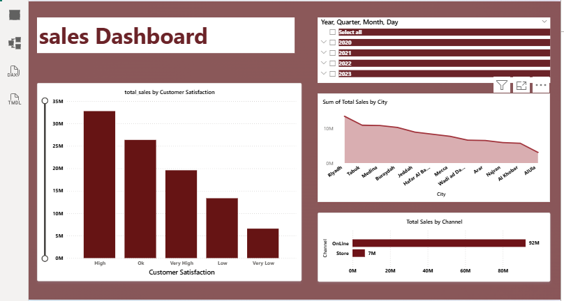

# Saudi-Arabia-sales
A simple sales dashboard built to analyze sales performance. It shows total sales, average sales, monthly trends, product category performance, and sales distribution by city. The dashboard helps identify key insights and supports data-driven business decisions.  Tools: Power BI, Data Analysis, Data Visualization 📊
1️⃣ نظرة عامة على المؤشرات الرئيسية

إجمالي المبيعات (total_sales): 98,651,993 تقريباً (≈ 98.6 مليون)

عدد العمليات (count_id): 49,998 عملية بيع

متوسط قيمة الطلب (avg_total_sales): 1,973

📊 هذا يعني:

حجم المبيعات كبير

متوسط الفاتورة قريب من 2000 وهو جيد إذا كان المنتج متوسط/مرتفع السعر.

📈 تحليل المبيعات حسب الشهر

الاتجاه العام:

أعلى شهر: ديسمبر ≈ 8.7M

أقل شهر: فبراير ≈ 7.9M

أفضل فترة: يوليو – أغسطس – ديسمبر

انخفاض واضح: نوفمبر ثم ارتفع بشدة في ديسمبر

💡 الاستنتاج:

يوجد Seasonality (موسمية)

غالباً ديسمبر بسبب:

العروض

نهاية السنة

مواسم الشراء

📌 اقتراح:

تكثيف الحملات التسويقية قبل ديسمبر (أكتوبر–نوفمبر).

  
    
  
    
  

